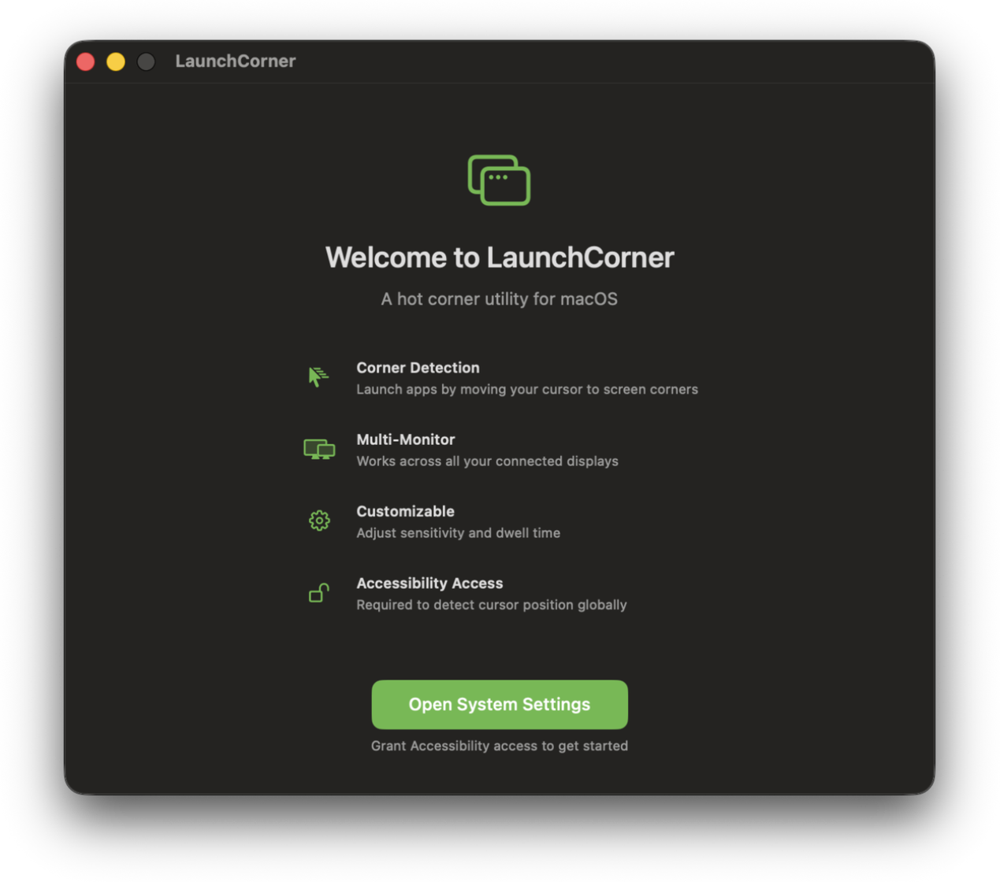
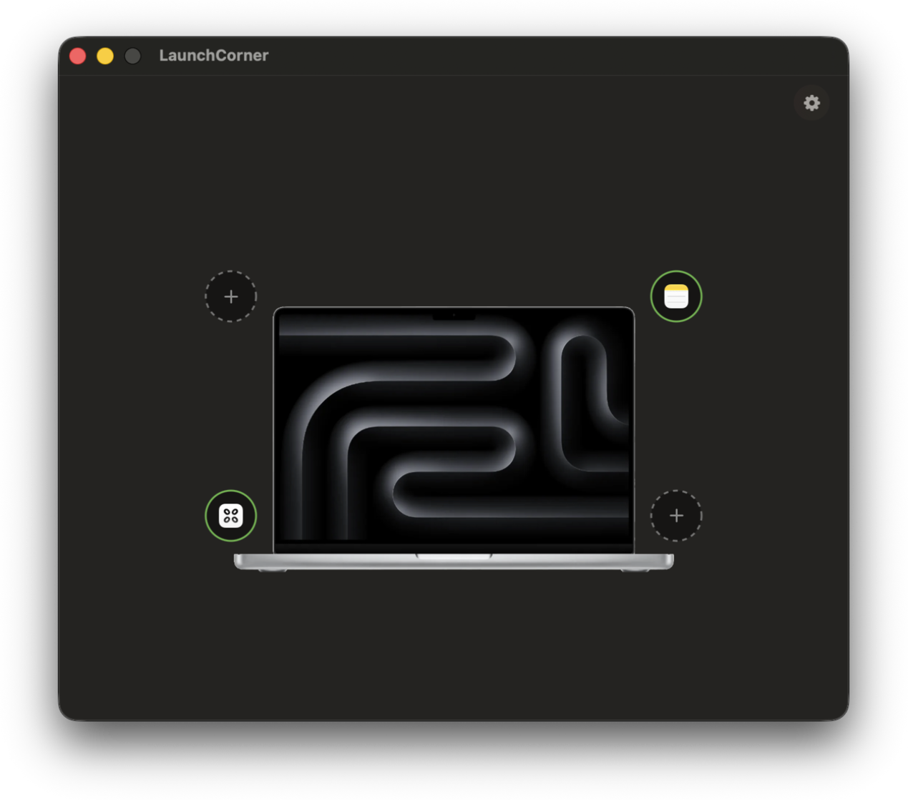
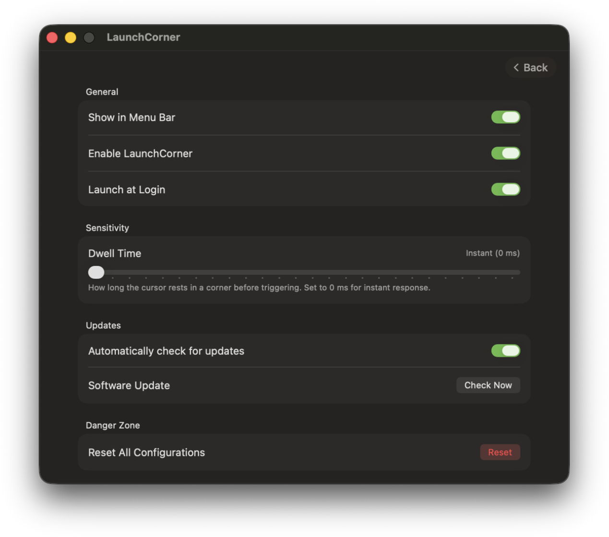

# LaunchCorner

> A lightweight, modern hot-corner app launcher for macOS.

[](https://www.apple.com/macos)
[](https://developer.apple.com/swift/)
[](LICENSE)
[-brightgreen.svg)]()

**LaunchCorner** turns your screen corners into instant app shortcuts. Simply move your cursor to any screen corner to launch your favorite applications instantly. Built natively for macOS using SwiftUI.

---

## Screenshots

<div align="center">
  <h3>1. Onboarding & Accessibility Permission</h3>
  
  <br /><br />
  
  <h3>2. Main Corner Configuration</h3>
  
  <br /><br />
  
  <h3>3. Settings & Sensitivity Controls</h3>
  
</div>

---

## Key Features

- **Instant Hot Corners**: Move your cursor to any of the 4 screen corners to trigger assigned applications.
- **Native & Ultra-Fast**: Built natively with Swift & SwiftUI for zero latency and minimal CPU/memory footprint.
- **Universal 2 Binary**: Native support for both **Apple Silicon** (M1/M2/M3/M4) and **Intel MacBooks**.
- **Dwell Time & Sensitivity**: Fine-tune trigger response down to **0 ms (Instant)**.
- **Multi-Monitor Support**: Works seamlessly across multiple connected displays.
- **Menu Bar & Dock Modes**: Runs quietly in the macOS Menu Bar and automatically hides from the Dock when closed.
- **Open Source**: 100% free and open-source under the MIT license.

---

## Installation

1. Download `LaunchCorner.zip` from the latest [Release](https://github.com/wenujacodes/LaunchCorner/releases).
2. Extract `LaunchCorner.app` and move it to your `/Applications` folder.
3. Launch **LaunchCorner** and grant **Accessibility Access** when prompted (*System Settings > Privacy & Security > Accessibility*).

---

## Building from Source

```bash
# Clone repository
git clone https://github.com/wenujacodes/LaunchCorner.git
cd LaunchCorner

# Open in Xcode
open LaunchCorner.xcodeproj
```

To build a release package (`LaunchCorner.zip`) locally:
```bash
./scripts/build_release.sh
```

---

## License

Distributed under the **MIT License**. Created by [@wenujacodes](https://github.com/wenujacodes).
